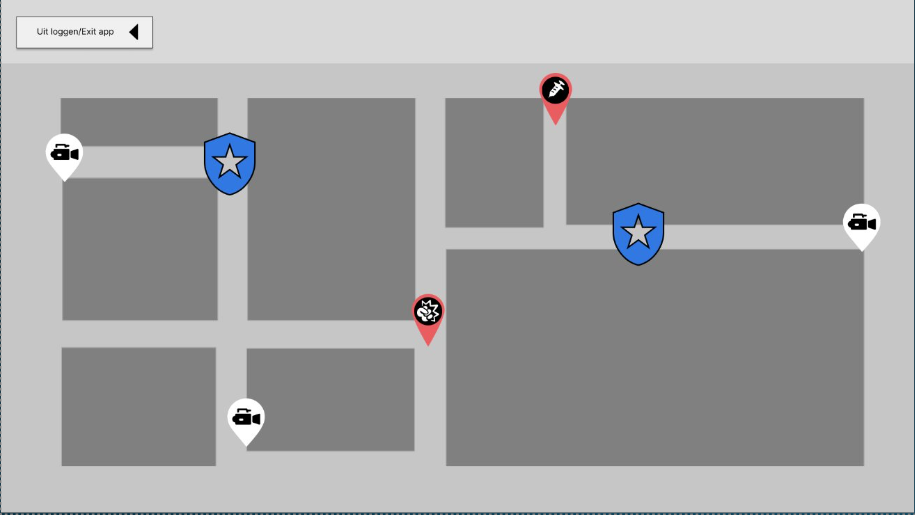
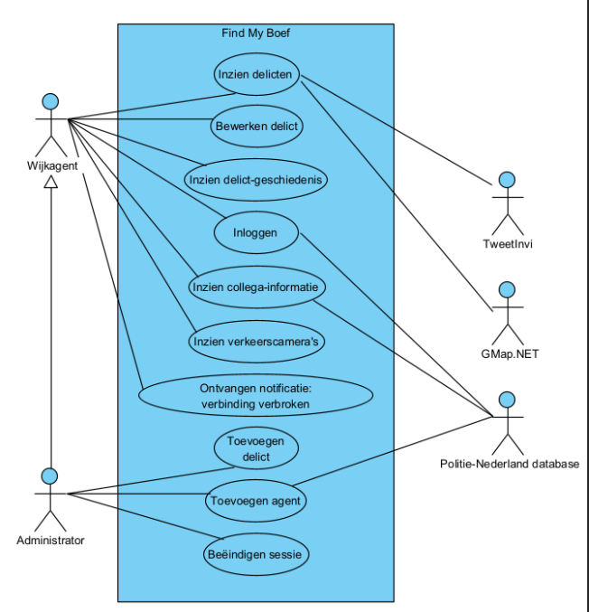
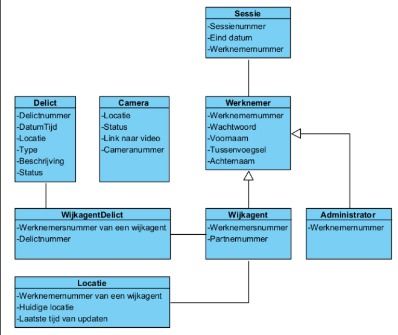
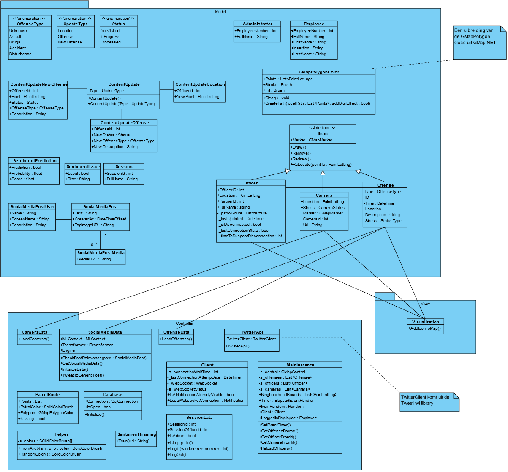

# Wijkagent
This project was made for a school project where the end-users would be local police officers (mocked project)

The goal of this project was to make an overview of the current town; displaying where crimes are active, where the hotspots are. - All in realtime, made possible by using websockets.

### Short sneak peek

### Some documentation

